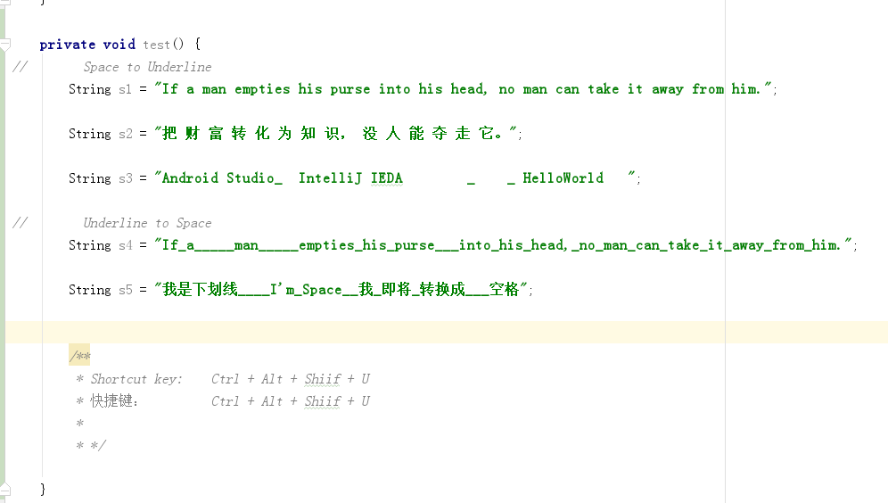
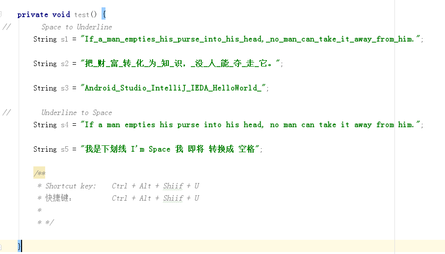
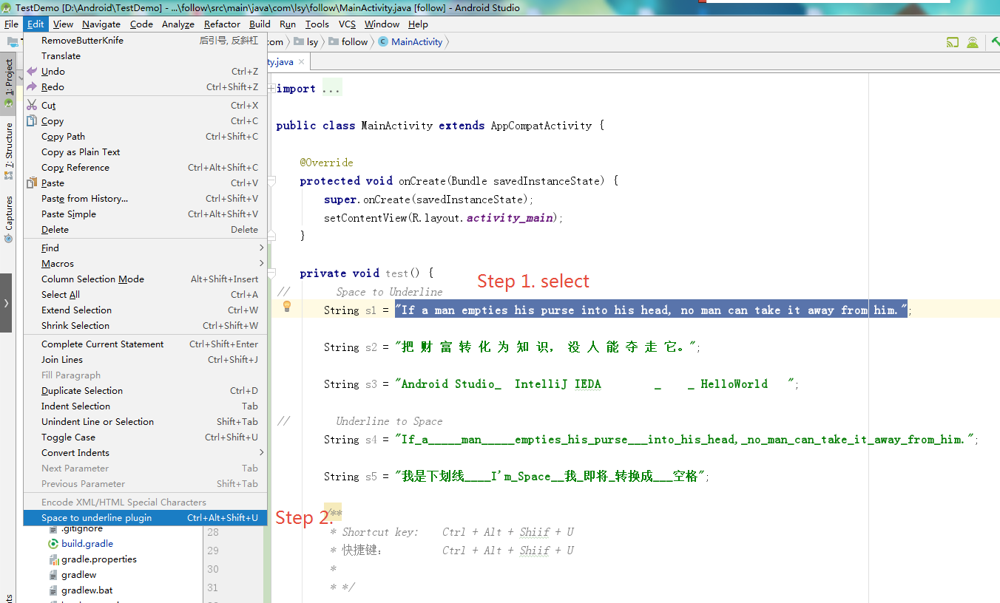
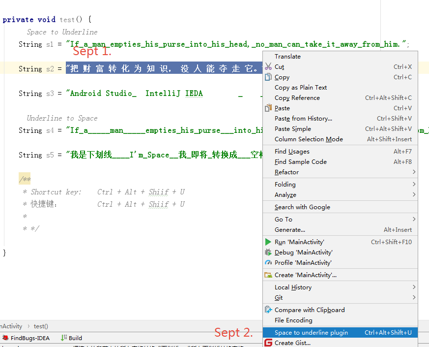

# Space to underline
  
### Description 描述:
        1. JetBrains (IntelliJ IDEA) plugin
        2. Space to Underline
        3. Underline to Space
        4. support all IntelliJ IDEA - JetBrains 
        -------------------------------------------
        1. JetBrains (IntelliJ IDEA)插件
        2. 段落文字空格转下划线
        3. 段落文字下划线转空格
        4. 支持JetBrains (IntelliJ IDEA)下的开发工具 (Android Studio 很舒服^_^)

###  Use 使用:
##### sept.1
        Select the paragraph
        -----------------------------
        选择文字段落

        
##### sept.2
        1. Toolbar -> Edit -> Space to underline
        2. right button -> Space to underline
        3. Shortcut Key:  Ctrl + Alt + Shift + U
        --------------------------------------------------------
        1. 工具栏 -> Edit -> Space to underline
        2. 右键 -> Space to underline
        3. 快捷键：Ctrl + Alt + Shift + U
   
-------------------------

